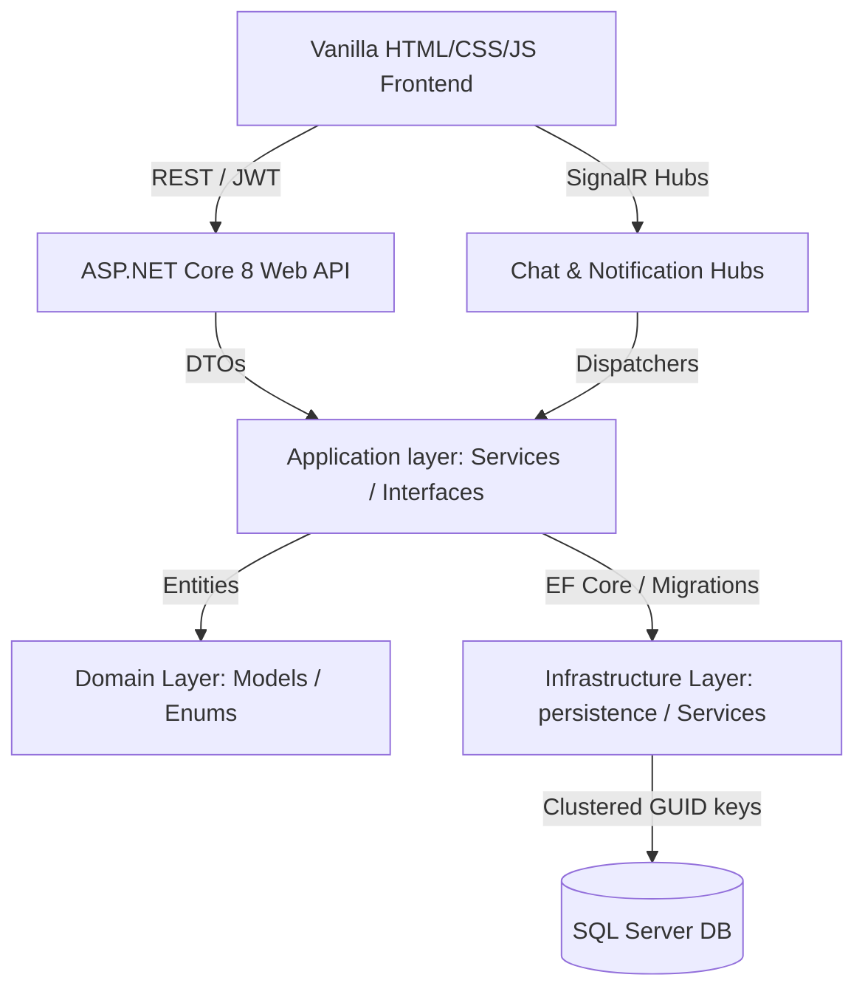
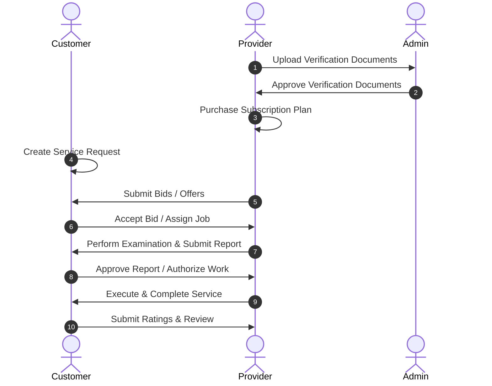

# Fixora

[](#)
[](#)
[](#)
[](#)
[](#)

Fixora is a next-generation, production-ready marketplace platform connecting customers with emergency home maintenance service providers. Designed as a high-performance, real-time, and role-secured application, Fixora handles the complete service lifecycle from registration, profile verification, and subscription setups to request creation, bid submission, real-time negotiation, execution tracking, and ratings.

---

## 1. Project Overview

### The Problem
Finding reliable home maintenance services during emergencies (e.g., plumbing leaks, electrical shorts, AC failures) is often stressful, slow, and lacks transparency. Customers struggle to compare offers, while service technicians lack streamlined avenues to bid on jobs, verify credentials, and track executions.

### The Solution
Fixora bridges this gap by offering a real-time marketplace. Customers post immediate home emergency requests, and verified service providers submit competitive offers. Real-time chat, live tracking, automated status synchronization, and review systems ensure high transparency and efficiency.

---

## 2. Key Features

- **Authentication & Security**: Strong JWT authentication, silent refresh token renewal, password encryption, and multi-layered route protection.
- **Verification System**: Documents upload and administrative review workflows for provider onboarding.
- **Subscription Engine**: Tiered subscription plans for service providers with automated expiration and billing triggers.
- **Service Request Lifecycle**: Complete marketplace process including request creation, bidding, technician selection, and examination report submission.
- **Real-Time Communication**: SignalR WebSocket integration driving instant messaging and status notification popups.
- **Analytics & Reporting**: Interactive administrative statistics, revenue tracking, user growth timelines, and performance audit reports.

---

## 3. System Architecture



### Architecture Details
1. **Frontend Architecture**: Client-side vanilla JS architecture utilizing modular configuration blocks (`api.js`, `auth.js`, `tokenManager.js`, `signalr.js`, `loading.js`, `errorHandler.js`).
2. **Backend Architecture**: Decoupled clean architecture separating concerns into:
   - **Domain**: Contains persistent entities, value objects, and domain enums.
   - **Application**: Holds DTOs, service contracts, mappings, and validation logic.
   - **Infrastructure**: Houses EF Core DbContext, migrations, local disk storage management, and concrete helper services.
   - **API**: Configures middleware, executes controllers, handles token validation, and manages SignalR sockets.

---

## 4. Tech Stack

- **Frontend**: Vanilla HTML5, CSS3 (with Custom Variables & Dark Mode support), Modern Vanilla JavaScript (ES6+).
- **Backend**: ASP.NET Core 8 Web API, Entity Framework Core (EF Core 8), SignalR, JWT Authentication.
- **Database**: Microsoft SQL Server.
- **Tooling**: Git, GitHub, Visual Studio, VS Code, Swagger UI.

---

## 5. Project Folder Structure

```
Fixora_project/
├── Backend_depi/              # Backend .NET Core Solution
│   ├── src/
│   │   ├── HomeEmergency.Domain/         # Entities, Enums, Domain Logic
│   │   ├── HomeEmergency.Application/    # Interfaces, DTOs, Core Logic
│   │   ├── HomeEmergency.Infrastructure/ # EF Core DbContext, Migrations
│   │   └── HomeEmergency.API/            # Controllers, SignalR Hubs, Program.cs
│   ├── tests/
│   │   └── HomeEmergency.Tests/          # Unit & Integration Tests
│   └── HomeEmergency.sln
└── fixora/                    # Frontend Vanilla JS Application
    ├── css/                   # Stylesheets (layouts, variables, dark mode)
    ├── html/                  # Web Views (Customer, Provider, Admin pages)
    └── js/                    # Modular JS files (api.js, script.js, signalr.js)
```

---

## 6. User Roles & Permissions

| Role | Permissions & Workflows |
|---|---|
| **Customer** | Create requests, view/compare provider bids, assign technicans, track executions, rate services, chat live. |
| **Provider** | Browse requests, submit bids/offers, upload verification files, purchase plans, execute jobs, write reviews. |
| **Company** | Corporate provider account managing multiple field technicians and subscription limits. |
| **Admin** | Access control management, warning issuances, document verification reviews, categories CRUD, plan CRUD, analytics reports. |

---

## 7. Business Flow Diagram



---

## 8. Real-Time WebSocket Synchronization

Fixora implements real-time messaging and status push broadcasts via ASP.NET Core SignalR:
- **Chat Hub (`hubs/chat`)**: Links active clients to real-time conversation channels (`chat:{chatId}`). Messages are pushed instantly and written to the database via backing REST API commands.
- **Notification Hub (`hubs/notifications`)**: Connects logged-in users to personal message groups (`user:{userId}`). It delivers system announcements, status updates, and bidirectional alerts.
- **Reconnection Resiliency**: The frontend uses `signalr.js` containing automatic reconconnections and exponential backoff, failing gracefully during network cuts without dropping core page functionalities.

---

## 9. Security Implementations

- **JWT Authentication**: Short-lived tokens with cryptographically signed headers.
- **Silent Refresh Tokens**: Automatic API renewal cycles utilizing HttpOnly cookie structures or secure local token managers.
- **Role-Based Authorization**: Blocked endpoints at backend level (`[Authorize(Roles = "Admin")]`) and client-side page protection checks.
- **Upload Safety**: Validation of file size limits, extensions, and MIME contents for provider verification documents.

---

## 10. Core API Endpoints Reference

| Endpoint | Method | Role | Description |
|---|---|---|---|
| `/api/auth/register` | `POST` | Public | Register a new user |
| `/api/auth/login` | `POST` | Public | Authenticate user and return JWT + Refresh Token |
| `/api/service-requests` | `GET` | Admin, Provider | List all service requests |
| `/api/service-requests` | `POST` | Customer | Post a new service request |
| `/api/provider-offers` | `POST` | Provider | Submit a bid offer on a request |
| `/api/admin/users/search` | `GET` | Admin | Search and filter system accounts |
| `/api/admin/documents/pending` | `GET` | Admin | List pending provider verification uploads |
| `/api/admin/analytics/users` | `GET` | Admin | Retrieve user growth statistics |

---

## 11. Database Entity Mappings

The data persistent layer maps standard relations:
- **One-to-One**: `ApplicationUser` mapped to `CustomerProfile`, `ProviderProfile`, and `CompanyProfile` sub-details.
- **One-to-Many**: `Category` to `ServiceRequest`, `ApplicationUser` to `UserWarning`, `Chat` to `Message`.
- **Many-to-Many**: `Chat` connections mapped to users via the `ChatParticipant` joining table.

---

## 12. Screenshots Placeholders

> [!TIP]
> Add screenshots of the interface inside this section to showcase your presentation work.
- **Admin Dashboard**: ``
- **Marketplace bidding**: ``
- **Chat Interface**: ``

---

## 13. Installation & Run Guide

### Prerequisites
- .NET 8 SDK
- SQL Server (LocalDB or Express)
- Visual Studio / VS Code
- IIS or static server (e.g. VS Code Live Server)

### Backend Configuration
1. Navigate to the backend directory:
   ```bash
   cd Backend_depi
   ```
2. Update the database connection string in `src/HomeEmergency.API/appsettings.json`:
   ```json
   "ConnectionStrings": {
     "DefaultConnection": "Server=(localdb)\\mssqllocaldb;Database=HomeEmergencyDb;Trusted_Connection=True;"
   }
   ```
3. Apply Entity Framework database migrations:
   ```bash
   dotnet ef database update --project src/HomeEmergency.Infrastructure --startup-project src/HomeEmergency.API
   ```
4. Start the backend Web API:
   ```bash
   dotnet run --project src/HomeEmergency.API
   ```

### Frontend Configuration
1. Open the file `fixora/js/config.js` and set the backend URL:
   ```javascript
   const CONFIG = {
       API_BASE_URL: "http://localhost:5000/api/",
       HUB_BASE_URL: "http://localhost:5000/hubs/"
   };
   ```
2. Run the frontend folder using a local server (e.g., Live Server extension in VS Code).

---

## 14. Testing

### Run Builds
```bash
dotnet build
```

### Run Unit Tests
```bash
dotnet test
```

---

## 15. Contributors

- **Technical Lead & Architect**: Salma H.
- **Development Team**: Home Emergency Project contributors.

---

## 16. License

This project is licensed under the MIT License - see the LICENSE file for details.

---

## 17. Version Information
- **Version**: `v1.0.0`
- **Release State**: Production Ready Release (Phase 1-11 Complete).
